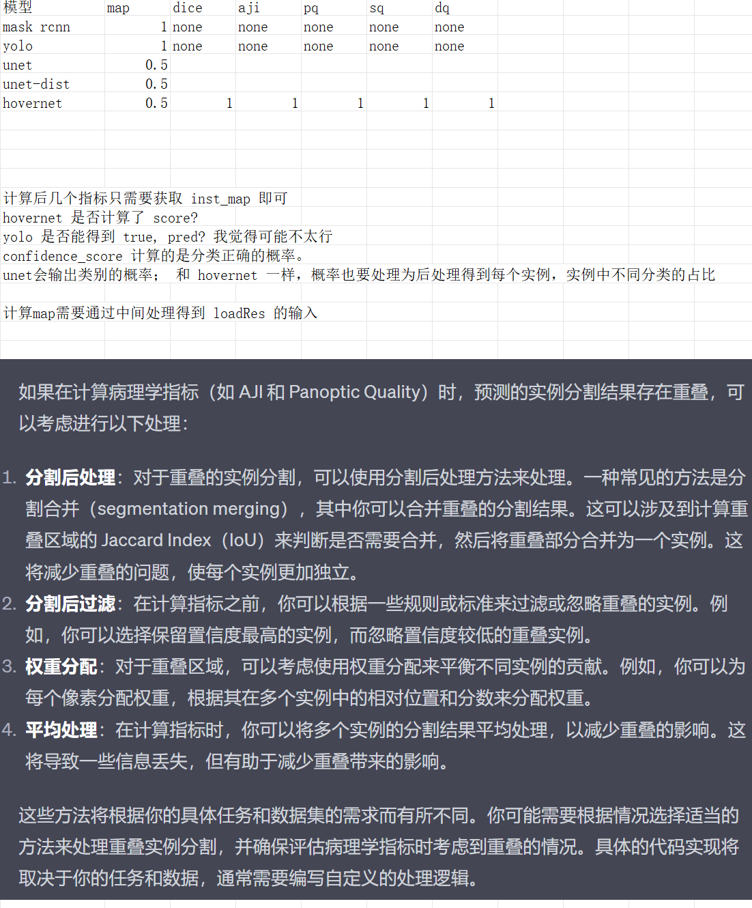

# pannuke_app

Code issues records(To be fixed):
- 数据的输入部分，各种格式的转换有点混乱，而且很容易出错，不容易校验
- dist net 的 vgg 部分是否可以和 unet+ws 部分进行合并？
    - 使用 mmsegmentation 的方式合并完成
- UNet 的训练部分只用到了语义分割的label， 而后续经过后处理评估却用了实例分割的效果。。。？？？？
    觉得可以直接把 ws 处理后的效果和实例分割的效果计算损失来更新模型
- 数据集的描述可以参考 COCO 论文, PASCAL VOC 介绍的信息等。
- 评估指标模块，关注 mAP 的计算（单张图片，单个类别，整体）； FLOPS， 推测速度；
    - PQ, AJI, DICE

# 代码结构
src:
- data_process 数据转换代码
    - 数据转换过程以 coco 格式 作为核心中枢。每个数据集首先通过一些初始变换，然后输入给 data_transformer 能够提取数据，convert2coco 基于 data_transformer 做上层调用，生成 COCO 格式
    - 在具体处理模型时，针对单个模型可能需要做特定的处理
        - yolo，需要运行代码将 coco格式转换为 yolo 格式
        - mmsegmentation unet，需要在原数据集上做处理，生成 png 格式的label
        - mmsegmentation unet_dist, 需要在原 png 格式label的基础上做 距离变换
            - 把这两步变换集中到 data_transformer 中 gen_masks 方法里，具体调用时，使用 temp_dir 的方法处理？

        把中转的 seg_mask 改为 png 格式， 按照重构后的文件夹目录重新改一下代码

    
    在最原始的数据集格式下，生成一份脚本，将数据集处理为结果格式，这个处理过程可以在一台设备上运行模型前快速完成。而不需要保存？或者中间有大数据量生成也不保存？
    还是直接生成结果数据保存为好，但是脚本也要有。

- models: 模型核心代码
    - MaskRCNN
    - HoVerNet
        - train
            - extract_patches 预处理数据
            - run_train.py
                - Before training:
                    Set path to the data directories in config.py
                    Set path where checkpoints will be saved in config.py
                    Set path to pretrained Preact-ResNet50 weights in models/hovernet/opt.py. Download the weights here.
                    Modify hyperparameters, including number of epochs and learning rate in models/hovernet/opt.py.
                - 01 训练时会自动读取 00 与训练吗？
    - UNet
    - UNet-dist
    - YOLOv8
        pip install ultralytics
        - 训练之前要先将数据集转换为 yolo 格式
            

- evaluation: 评估相关

## UNet 后处理

# 评估指标
## 预测后的数据类型

衔接评估时的数据类型
以及可视化时候的数据类型

规划一个中转类型？比如 COCO？或者别的，然后在这个基础上做针对每个评估指标的转换？

mAP 因为需要score 的输出，unet和unet-dist 不参与评估。
yolo，maskrcnn，hovernet 要做 mAP.
5中模型都要做 PQ, AJI, DICE.

复看之前的评估代码，发现根本没有必要做修改。之前做修改只是为了 maskrcnn 做适配。但是我发现其实不去计算就好了。
### 确认 hovernet 的评估代码，然后？
aji, aji+, dice, pq 这些都只需要使用 inst_map 参与计算就可以了。
hover中提出的分类指标不予计算。
proposal 的方式，为什么一定要计算呢，不算拉倒。

## 整理
evaluate::coco_pred 中写了一个转换为 coco api 可读的脚本，后续计算图的 map 可以参考。

TODO
- 几个数据集 hovernet 的输入，输出
    - hovernet 用原来的代码完全顺利跑起来，但是用了 numpy==1.19.1, yolo 需要更高版本，跑模型时候需要注意。
- unet的后处理
- 整体的评估批量运行

## 关于几个模型的评估口径，在论文中可以仔细描述

明日工作核心：校验整个评估的代码是否没问题。
- pq 等计算maskrcnn, yolo 的处理是否ok
- unet, hovernet 计算 mAP 的数据， 关键是确定 loadRes 或者 torchmetrics 中对mask de yaoqiu 
- 两者之间，因为 maskrcnn, yolo 也需要处理mask， 两者要结合参考;
     - maskrcnn 输出的 segmentation 就是 rle，应该不需要额外做转换。

计算每张图片的效果这个，算了，不算了，太麻烦了，而且很多小问题。先不管，顾全大局。

将 autodl 改为 processed.zip 由百度网盘下载。本身镜像不包含数据集。
[mmseg 改为 epoch 训练； best model 保存](https://blog.csdn.net/qq_38308388/article/details/127552607)

# 目前来说，还是每个模型分别进行训练、评估比较好理解。
几个模块都基础代码有了，明天跑一波全的代码。这几天就陆陆续续把几个模型跑完。模型的部分应该就差不多了。
为了方便模型拓展，我想换一次代码架构
- models
    - 每个模型包含相应的训练配置，训练代码，以及预测，评估需要做的处理

外层的具体数据集上的运算，则作为 projects 进行，相当于我有三个数据集，对应三个projects， 然后每个projects是运行5个模型，得到 15个结果。

predict: 在当前文件夹生成预测结果文件？
- 原始的预测结果？
- 计算 mAP 的预测结果？
- 计算 PQ 的预测结果？

另一种方法就是不保存，直接评估。

maskrcnn:
- 训练得到的 epoch.pth, cfg (yes)
- 预测(yes)
- 转换格式(map, )
- 计算指标(yes)

unet, unet-dist
- 训练(yes)
- 预测(yes)
- 转换格式(yes)
- 计算指标(yes)

评估 map 时关注 maxDets 的参数影响

hovernet
- 训练(yes)
- 预测(yes)
- 转换格式(yes)
- 计算指标(yes)

为了适应数据传递， consep 的load_ann 是不是要改为 process 之后的数据方式？