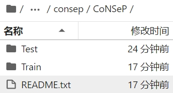
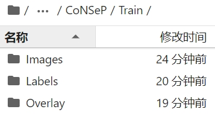
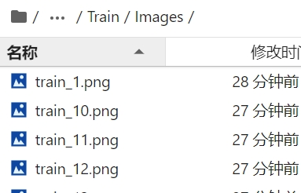
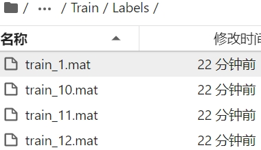
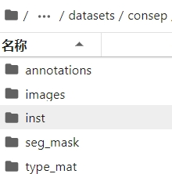
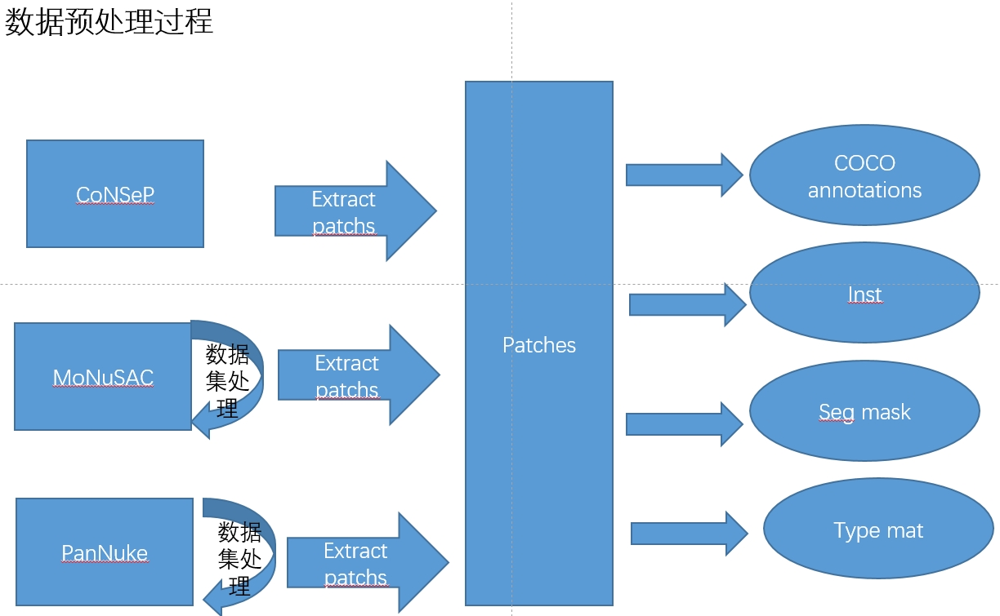

# 记录数据预处理的全过程
CoNSeP 数据集的原始格式为
- Train
    - Images: .png format
    - Labels: .mat format, Each ground truth file is stored as a .mat file, with the keys:
    'inst_map': a 1000x1000 array containing a unique integer for each individual nucleus. i.e the map ranges from 0 to N, where 0 is the background and N is the number of nuclei.
    'type_map': a 1000x1000 array where each pixel value denotes the class of that pixel. The map ranges from 0 to 7, where 7 is the total number of classes in CoNSeP.
    'inst_type': a Nx1 array, indicating the type of each instance (in order of inst_map ID)
    'inst_centroid': a Nx2 array, giving the x and y coordinates of the centroids of each instance (in order of inst map ID).

    Note, 'inst_type' and 'inst_centroid' are only used while computing the classification statistics. 
    The values within the class map indicate the category of each nucleus.  

    Class values: 1 = other
            2 = inflammatory
            3 = healthy epithelial
            4 = dysplastic/malignant epithelial
                5 = fibroblast
                6 = muscle
            7 = endothelial

    In this paper we combine classes 3 & 4 into the epithelial class and 5,6 & 7
    into the spindle-shaped class.
    Total number of nuclei = 24,319







采用 HoVerNet 的思路处理数据？

转换的最终目的是：
- annotations: coco  .json format
    - test
    - train
- images: .jpg format, the original format of images(# TODO, jpg? png? does it matter?)
    - test
    - train
- inst: .npy format, instance mask, which means different id represent different nuclei
    - test
    - train
- seg_mask: .png format, seg mask, which means different id represent different category of nuclei.
    - test
    - train
- type_mat: .mat format, type mask, with keys 
            - 'inst_type': nuclei type
            - 'inst_centroid': nuclei centroid
    - test
    - train




the whole process of preprocessing can be described as this graph.



extract_patch


# google colab 加载数据集
因为google drive 只有15G, 还是弃用？
其实 CoNSeP, MoNuSAC 是ok的。

上传 consep, monusac

# autodl 云网盘下载
[创建应用](https://pan.baidu.com/union/console/applist?from=person)
用百度网盘下载已经保存在网盘里的三个数据集到服务器上(用时？15:12 开始,)

```bash
# 解压数据集


```